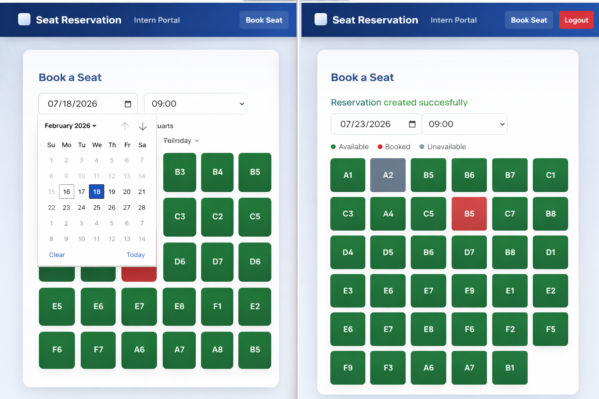
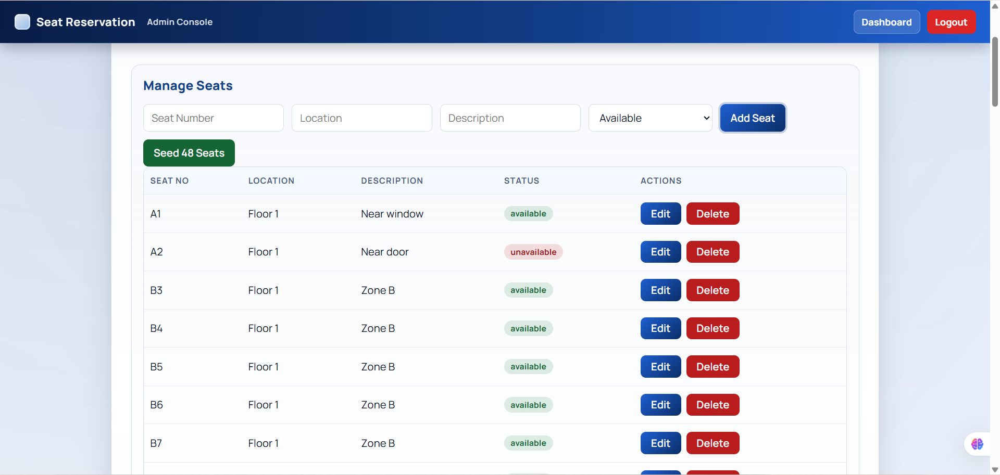
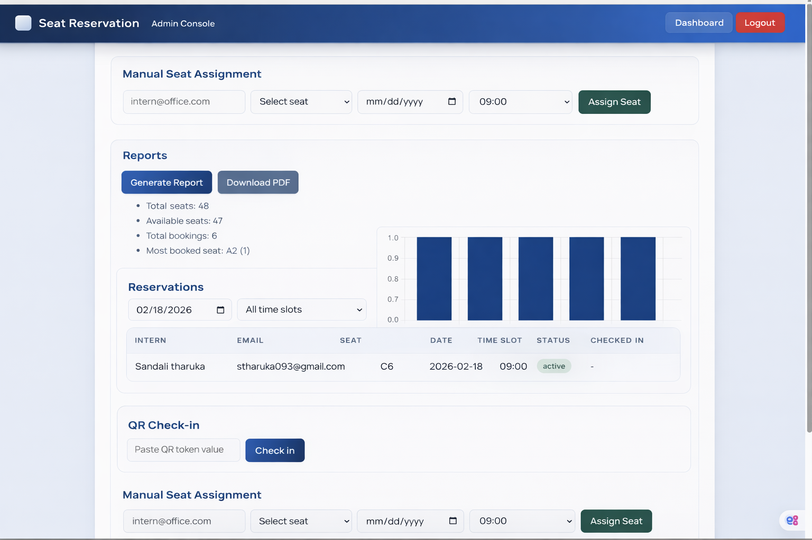
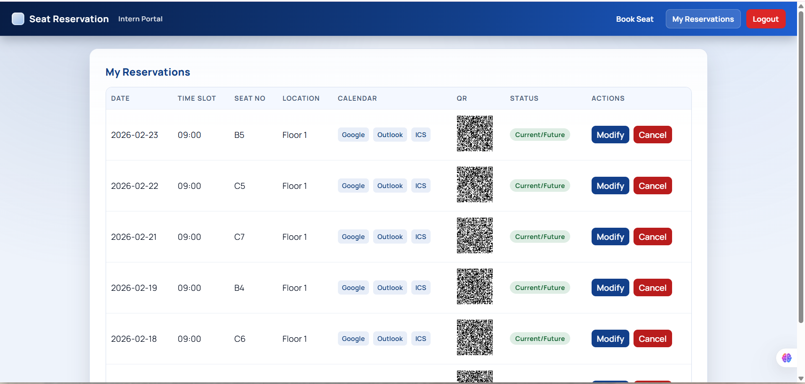

# Seat Reservation System

[](#tech-stack)
[](#tech-stack)
[](#tech-stack)
[](#tech-stack)

A role-based seat booking platform for interns and admins with QR check-in, reports, and calendar-ready reservations.

## Screenshots

### Login


### Intern - Book Seat


### Admin - Manage Seats


### Admin - Reports


### Intern - My Reservations


### Google Login


## Features

- Intern & Admin authentication (JWT + optional Google login)
- Seat booking by date and time slot
- Validation rules (no double booking, one seat/day, future-only updates)
- Admin seat management (add/edit/delete + seed default seats)
- Admin reservation search and manual assignment
- QR token generation and admin check-in flow
- Reports (chart + PDF export)
- Calendar links (Google/Outlook) + ICS file export
- Reminder service (email; optional SMS via Twilio)

## Tech Stack

- Frontend: React, React Router, Axios, Chart.js, jsPDF
- Backend: Node.js, Express, MongoDB, Mongoose, JWT
- Auth/Utils: bcryptjs, Firebase Auth, Nodemailer

## Quick Start

### 1) Backend

```bash
cd backend
npm install
npm start
```

### 2) Frontend

```bash
cd frontend
npm install
npm start
```

- Frontend: `http://localhost:3000`
- Backend: `http://localhost:5000`

## Environment (`backend/.env`)

```env
PORT=5000
MONGO_URI=mongodb://localhost:27017/seat_reservation_db
JWT_SECRET=your_jwt_secret

EMAIL_USER=your_email@gmail.com
EMAIL_PASS=your_email_app_password

OFFICE_EMAIL_DOMAIN=
ADMIN_REGISTER_KEY=change-this-admin-key

TWILIO_ACCOUNT_SID=
TWILIO_AUTH_TOKEN=
TWILIO_PHONE_NUMBER=
```

## Admin Bootstrap (optional)

```powershell
$body = @{
  name = "Admin User"
  email = "admin@example.com"
  password = "Admin@12345"
  role = "admin"
  adminKey = "change-this-admin-key"
} | ConvertTo-Json

Invoke-RestMethod -Method Post -Uri "http://localhost:5000/api/auth/register" -ContentType "application/json" -Body $body
```

## Project Structure

```text
seat-reservation-system/
  backend/
  frontend/
```

## License

For academic/internship use. Add a formal license (e.g., MIT) if needed.
